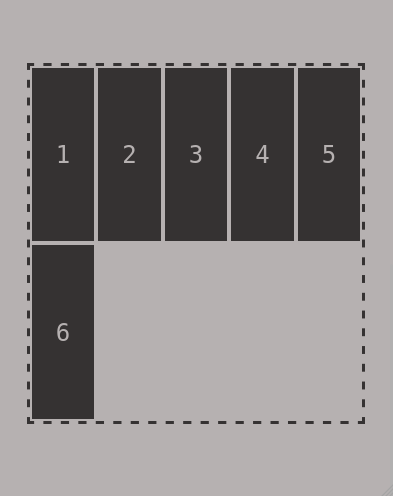

# Pilha e Fila

Este projeto apresenta as estruturas Pilha e Fila de forma visual utilizando HTML, CSS e JavaScript. 

Foram trabalhados conceitos de responsividade, além de praticar conceitos básicos do JavaScript. O uso do vetor de elementos para as estruturas no JavaScript é dispensável neste projeto, porém ele foi mantido para fins didáticos.

## :gear: Tecnologias

- HTML
- CSS
- JavaScript

## :art: Layout

